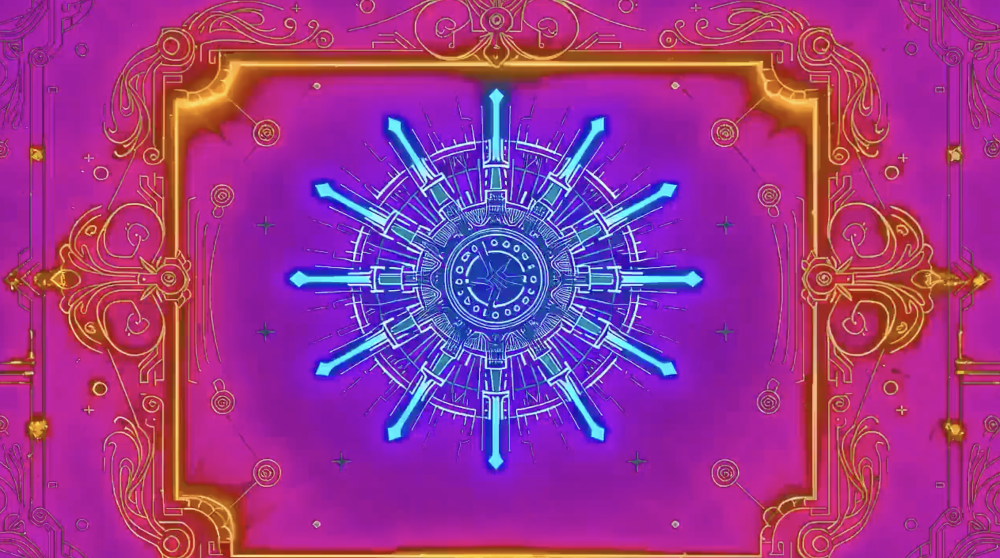

# Schizo Video Generator

A skill for Claude that generates complete 30-45 second music videos from a single text prompt.



## What it does

1. Generates 10 esoteric AI images from your vibe prompt
2. Animates each into a 2-7s video clip via `fal-ai/wan/v2.7/image-to-video` (variable per clip for natural pacing)
3. Creates a matching instrumental soundtrack (minimax-music returns a 3-5 min track; it gets trimmed to video length in the final mix)
4. Concatenates clips into a 30-45s base video (no trimming — clips are already the target length)
5. Applies 8 layers of glitch effects:
   - Progressive pixel sorting (grows 30%→85% intensity)
   - RGB channel splitting + VHS tears
   - Color pumping (red/blue balance shifts)
   - Growing film grain
   - Psychedelic color shifts
   - Negative flashes with color tints

**Cost:** ~$4.67 per video at 1080p (wan/v2.7 is $0.10/sec × 45s default — scales linearly with total clip duration)  
**Runtime:** 15-20 minutes  
**Output:** 1920x1080 @ 30fps MP4

## Quick start

```bash
# Install dependencies
pip3 install fal-client requests pillow numpy

# Set your FAL API key
export FAL_KEY="your-key-here"

# Run the pipeline
python3 scripts/schizo_video.py "psytrance dmt trip cosmic entities" --output-dir ./my-video
```

See `SKILL.md` inside the skill folder for full documentation, customization guide, and troubleshooting.

## Using as a Claude Skill

1. Download this repo or the `.zip` file
2. Upload to Claude: Settings > Capabilities > Skills > Upload skill
3. Ask: "Generate a music video from the prompt 'vaporwave retro neon'"

## Requirements

- **FAL API key** — get at [fal.ai/dashboard/keys](https://fal.ai/dashboard/keys)
- **Python 3.10+**
- **FFmpeg 7.1+** with libx264

## Examples

```bash
# Psychedelic
python3 scripts/schizo_video.py "psytrance 145bpm cosmic transcendence"

# Dark
python3 scripts/schizo_video.py "dark industrial tribal ritual 140bpm"

# Relaxing
python3 scripts/schizo_video.py "ambient meditation ethereal space journey"
```

## License

MIT
